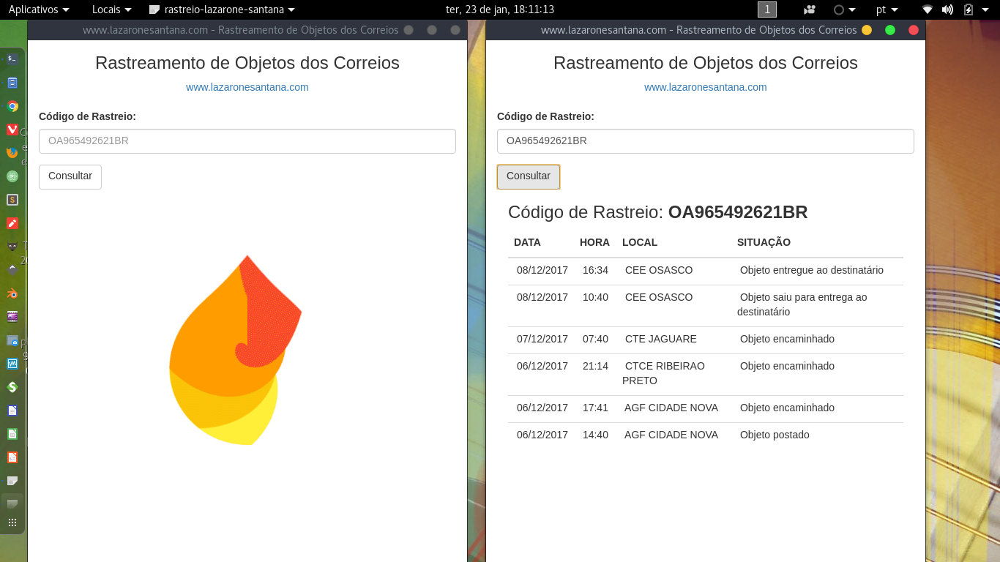
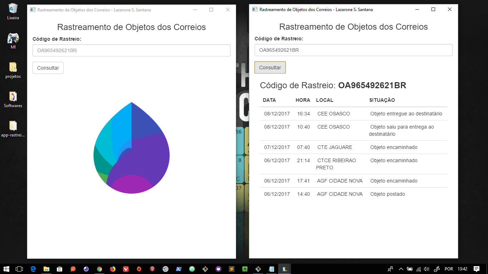

# app-rastreio

**Aplicativo Desktop para rastreamento de objetos dos correios.**

```bash
# Clone este repositório
git clone https://github.com/lazaroness/app-rastreio.git
# Entre no repositório
cd app-rastreio
# Instale as dependências
npm install
# Execute o aplicativo
npm start
```

# Downloads

[](https://github.com/lazaroness/app-rastreio/raw/master/dist/setup-app-rastreio.exe)


  
# Install Linux

```
su -
npm install -g electron-packager
electron-packager . app-rastreio --platform linux --arch x64 --out /usr/share/
mv /usr/share/app-rastreio-linux-x64/ /usr/share/app-rastreio/
cd /usr/share/app-rastreio/
cp resources/app/img/app-rastreio.png /usr/share/icons
cp resources/app/app-rastreio.desktop /usr/share/applications/app-rastreio.desktop
```

[](https://youtu.be/NZFvL4svFi0)

# Gerando o executavel e executando no Windows

```
npm install -g electron-packager
electron-packager . app-rastreio --overwrite --platform=win32 --arch=ia32 --icon=img/app-rastreio.ico --prune=true --out=release-builds
cd release-builds/app-rastreio-win32-ia32/
duplo clique no arquivo app-rastreio.exe
```

[](https://youtu.be/NZFvL4svFi0)

## Licença

[CC0 1.0 (Domínio público)](LICENSE.md)
