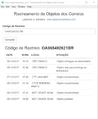

# app-rastreio

**Aplicativo Desktop para rastreamento de objetos dos correios.**

```bash
# Clone este repositório
git clone https://github.com/lazaroness/app-rastreio.git
# Entre no repositório
cd app-rastreio
# Instale dependências
npm install
# Execute o aplicativo
npm start
```




## Licença

[CC0 1.0 (Public Domain)](LICENSE.md)
